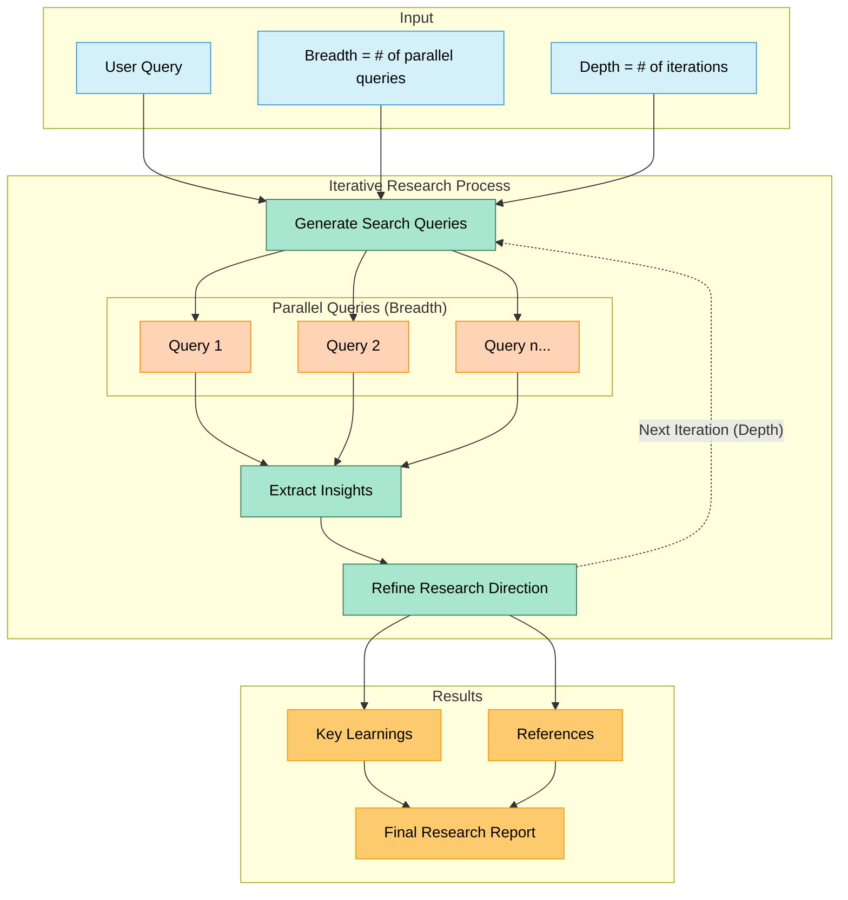

# Fireworks ArXiv Research Assistant

A streamlined tool for conducting in-depth academic research using Llama 4 models and the arXiv paper repository.

## How It Works



## Overview

This tool lets researchers quickly explore academic literature through an iterative discovery process. It searches arXiv, analyzes papers, and generates comprehensive research reports—all powered by state-of-the-art language models via Fireworks AI.

## Key Concepts

- **Breadth**: The number of parallel query paths explored in each iteration
- **Depth**: The number of research iterations performed, each building on previous findings
- **Research Direction**: Evolves between iterations based on insights gained

## Features

- **Iterative Research**: Builds knowledge progressively across multiple research iterations
- **Parallel Exploration**: Investigates multiple query paths simultaneously
- **Real-time Progress**: Displays ongoing research activity with detailed logging
- **Comprehensive Reports**: Generates structured research reports with citations

## Model Support

- **Llama 4 Models** (via Fireworks):
  - **Maverick**: Optimized for reasoning and instruction following
  - **Scout**: Provides extended 10M token context window
- **OpenAI Models**:
  - **GPT-4o**: For comparison benchmark purposes
- **Custom**: Any other model hosted by Fireworks

## Getting Started

Visit <https://fw-deep-research-llama.streamlit.app> or run locally:

### Installation

```bash
# Clone the repository
git clone https://github.com/yourusername/arxiv-research-assistant.git
cd arxiv-research-assistant

# Set up a virtual environment
python -m venv venv
source venv/bin/activate  # On Windows: venv\Scripts\activate

# Install dependencies
pip install -r requirements.txt
```

### Usage

```bash
# Run the Streamlit app
streamlit run streamlit_app.py
```

Visit `http://localhost:8501` in your browser to access the application.
